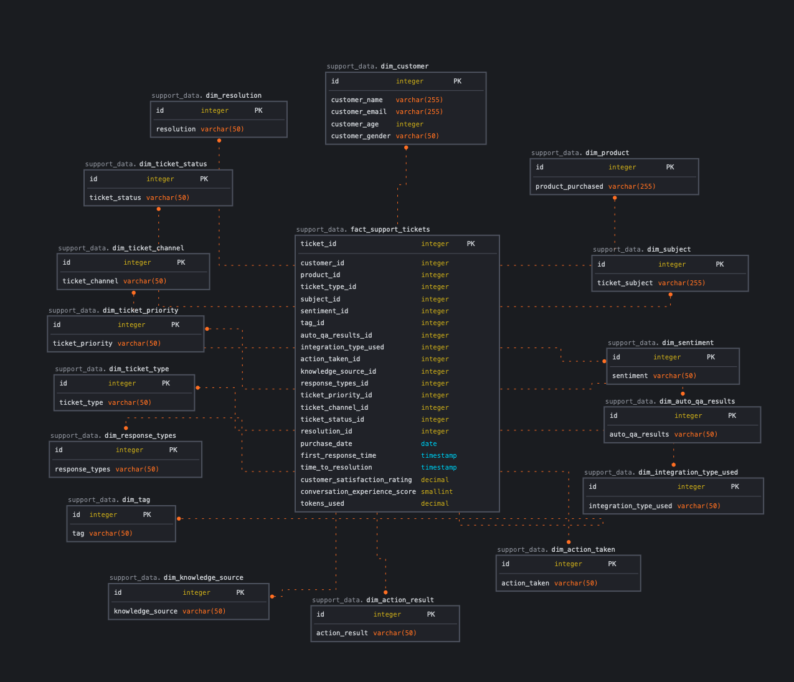

# Automation Performance Dashboard

Welcome to the Automation Performance Dashboard project! This project aims to provide real-time insights and analytics on automation performance using AWS services such as Glue, Redshift, S3, and QuickSight.

## Table of Contents

1. [Introduction](#introduction)
2. [Architecture Overview](#architecture-overview)
3. [Pipeline Architecture](#pipeline-architecture)
4. [Data Warehouse Design](#data-warehouse-design)
5. [Prerequisites](#prerequisites)
6. [Getting Started](#getting-started)
7. [Project Structure](#project-structure)
8. [Deployment](#deployment)
9. [Usage](#usage)
10. [License](#license)

## Introduction

This project implements a data pipeline to automate the extraction, transformation, loading, and visualization of automation performance metrics. Leveraging AWS services, the project provides an end-to-end solution for analyzing and visualizing data, allowing stakeholders to gain insights into the effectiveness of automation processes.

## Architecture Overview

The architecture of the Automation Performance Dashboard project involves the following components:
- **AWS API Gateway**: Receives .csv files and puts then in S3.
- **Amazon S3**: Stores raw and processed data files.
- **AWS Lambda**: Receives trigger from objects uploaded into S3 .
- **AWS Glue**: Handles data cataloging, ETL processes, and job orchestration.
- **Amazon Redshift**: Acts as the data warehouse for storing transformed data.
- **Preset.io**: Data visualization tool.

### Pipeline Architecture


### Data Warehouse Design


## Prerequisites

Before running the project, ensure you have the following prerequisites installed:

- Terraform
- AWS CLI
- Python
- Access to an AWS account with appropriate permissions to create and manage resources


## Getting Started

To get started with the project, follow these steps:

1. Clone the repository to your local machine.
2. Configure AWS CLI with your AWS account credentials.
3. Initialize Terraform in the project directory.
4. Modify the Terraform configuration files as needed.
5. Deploy the infrastructure using Terraform.
6. Run the ETL processes using AWS Glue or custom scripts.

For detailed instructions, refer to the [Setup Instructions](setup_instructions.md) and [Deployment Guide](#deployment).

## Project Structure

The project directory structure is organized as follows:
```

/automation-performance-pipeline
    /data
        # Raw dataset, completed dataset, and scripts to explore and generate values required
    /terraform
        # Terraform configuration files for infrastructure setup
    /services
        /glue
            # Custom ETL script for data processing
        /lambda
            # Lambda script and package for deployment
        /redshift
            # SQL script to create database schema
    /docs
        README.md              # Project documentation
        setup_instructions.md  # Setup and run instructions
        presentation.pdf      # Project presentation slides


```

## Deployment

To deploy the project infrastructure, follow these steps:

1. Create an environment variable called ```BUCKET``` with the bucket name you want to use for your project.
2. Navigate to the `/terraform` directory.
3. Initialize Terraform with `terraform init`.
4. Review the Terraform execution plan with `terraform plan`.
5. Apply the changes to create the infrastructure with `terraform apply`.
6. Monitor the deployment progress and confirm any prompts.


## Usage

Once the infrastructure is deployed, you can start using the Automation Performance Pipeline:

1. Run ```sh bash.sh``` to upload required files 
2. Run the ETL processes to extract, transform, and load data into Amazon Redshift.
3. Configure Redshift connection to your data vizualization tool.
4. Access the dashboards to visualize automation performance metrics.


## License

This project is licensed under the [MIT License](LICENSE).
